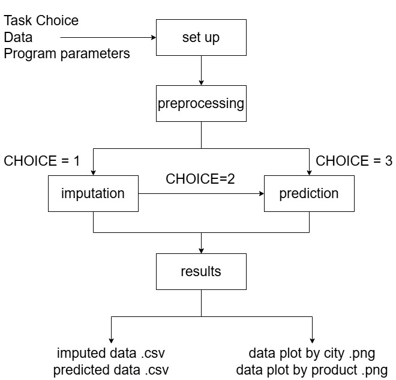

# IMPACT

## Authored By
- Gabriel Häfner  
- Diana Korotun  
- Annamalai Lakshmanan  
- Mentor: Teodora Bujaroska  
- Person of Contact: Francesco Gizzarelli  

## Summary 
This repository hosts the pipeline developed for the IMPACT Initiative, designed to address data imputation and forecasting challenges in humanitarian operations. Specifically tailored for Syria (2016–2024), the pipeline provides robust imputation and prediction of commodity price data, enabling the calculation and forecasting of the Minimum Expenditure Basket (MEB).  

## Installation
Clone the repository and install dependencies:  
```
git clone https://gitlab.com/analytics-club/hack4good/hack4good-fall-2024/impact.git  
cd impact
conda env create -f environment.yml  
conda activate impact
```
__Note__: There may be incompatibilities between pmdarima and numpy in some environments. If issues arise, try downgrading the numpy version. See the pmdarima [GitHub issue #577](https://github.com/alkaline-ml/pmdarima/issues/577) for details.

## How to run
- __upload__ your raw data file as `data/raw/dataframe_raw.csv`.
  - If you wish to change the address where the raw data is uploaded from, it can be done by changing the constant `impact/set_up/addresses_constants.py/ADRS_RAW_DATA`
  - The program support .parquet and .xlsx. However, there were few tests done with the former, and .xlsx was taking almost an hour to load, as opposed to half a minute with CSV.

- __Adjust Parameters__ in `impact/set_up/constants.py` as you wish to run the pipeline. The adjustable parameters include:
  - ADMIN_LOCATIONS: a dictionary of admin level which will be imputed
  - PRODUCTS_LABELS: a list of products which will be imputed
  - PREDICT_ADMIN: a String value of the admin level that will be predicted
  - PREDICT_CITIES: a String of cities which will be predicted
  - PREDICT_PRODUCTS: a list of products that will be predicted
  - CHOSEN_MIN_DATE: a String in YYYY-MM format for the minimum month of the analyzed data.
  - CHOSEN_MAX_DATE: a String in YYYY-MM format of the maximum month of the analyzed data. If data is being predicted this value needs to be larger than the original most recent month of the raw data.
     - note, that at least one of the dates needs to be in range of the raw data. Otherwise, the program will request that you change their value.
- __Run main.py__
once run you will be prompted to choose the task that will be performed by the pipeline:
  1. only imputation  
  2. imputation followed by prediction  
  3. only prediction 
- __Results__ can be found in the `data/processed/<unix_timestamp>` and the plots of the processed data can be found in `data/plot/<unix_timestamp>`

### Note:
- The pipeline was developed specifically for Syria data collected from 2015-03-21 to 2024-03-03. To run the pipeline on a data set in a different region, with raw data from a time frame, different product list, or a different MEB product quantity please change the new parameters accordingly in  `impact/set_up/labels.py` as this file contains the description of the raw data.
  - labels should only be updated if the primary raw data set changes. For changes in pipeline parameters please refer to constant.py as instructed above.
- If you decide to perform any kind of prediction, please note that in softwares where constants are not overridden well - such as Jupiter Notebook - `impact/set_up/constants.py/N_MONTH` will not be updated per the difference between the user-chosen max_month and raw data max month. This might require the variable to be changed manually.
- If you decide to only perform prediction, ensure that fully imputed data exists in a file of the following format: `data/processed/imputed_admin<insert level>_label_full.csv`
  - To generate a fully imputed file please run one of the pipeline’s imputation options first.
  - To load imputed data from a different location update `impact/set_up/addresses_constants.py/ADRS_IMPUTED_ADMIN<insert level>`
- When exporting results, note that by default the UNIX timestamp is `000000000`. As such, when the code runs with Jupyter Notebook or other setups where constant might not update properly, the results will be exported to `data/processed/000000000` and `data/plot/000000000`.

## expected output
The results are exported as:

__CSV files:__  
_Imputed data:_ `data/processed/<UNIX_timestamp>/imputed_admin<level>_label.csv`  
_Predicted data:_ `data/processed/<UNIX_timestamp>/predicted_admin<level>_label.csv`  
__PNG Plots:__  
Product-wise and region-wise visualizations in PNG format stored in `data/plot/<UNIX_timestamp>/admin<level>_label_<region/product>.png`.

## Pipeline diagram
insert image of the pieline


<a target="_blank" href="https://cookiecutter-data-science.drivendata.org/">
    
</a>
--------

